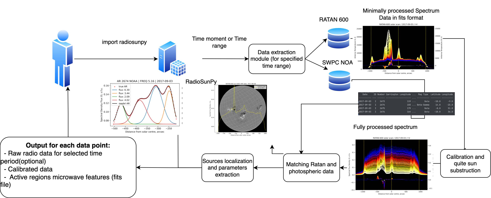

# ``RadioSunPy``
``RadioSunPy`` 

RadioSunPy is a Python package developed for accessing, visualizing, and analyzing
multi-band radio observations of the Sun from the RATAN-600 complex. These data are 
valuable for diagnosing solar plasma conditions and predicting solar activity. 
However, working with these data requires extensive processing and a thorough 
understanding of the RATAN-600 system. The package offers comprehensive data 
processing functionalities, including direct access to raw data, essential 
processing steps such as calibration and quiet Sun normalization, and tools for 
analyzing solar activity. This includes automatic detection of local sources,
identifying them with NOAA active regions, and further determining parameters for 
local sources and active regions.



## Installation

To install RadioSunPy, run the following command:
```bash
pip install radiosunpy
```

## Usage
 
For more detailed information about the package and its functionalities, please refer to the [official documentation](https://radiosunpy.github.io/RadioSunPy/).
The best place to start is the in [example gallery](https://github.com/radiosunpy/RadioSunPy/tree/main/notebooks)  
also includes a collection of shorter and more specific examples of using radiosunpy, or you can look at example usages in [colab notebook](https://colab.research.google.com/drive/1JCaW_Kj-1Al-sDoNhJRawlSit5gietKm?usp=sharing) if you want to try it yourself. 

<p align="center">
  
</p>


## Contributing

Contributions are welcome! If you have suggestions for improvements or bug fixes, 
please feel free to open an issue or submit a pull request.

